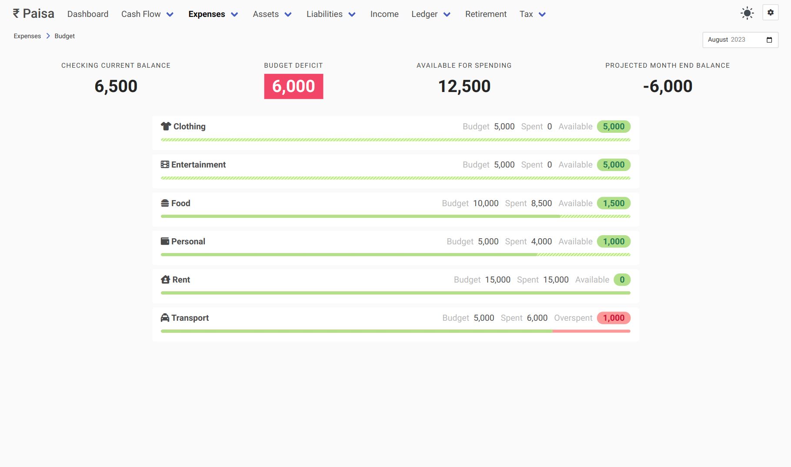
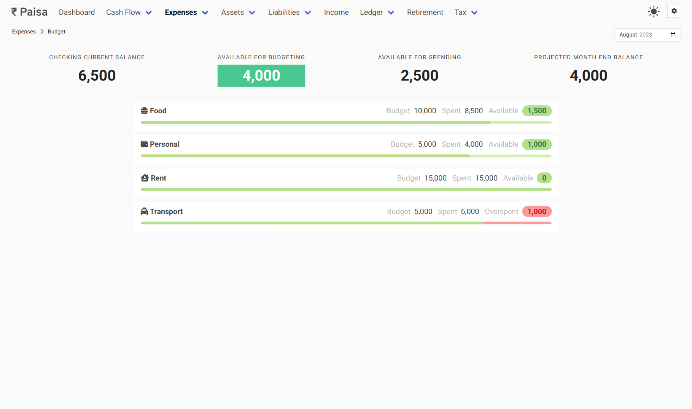
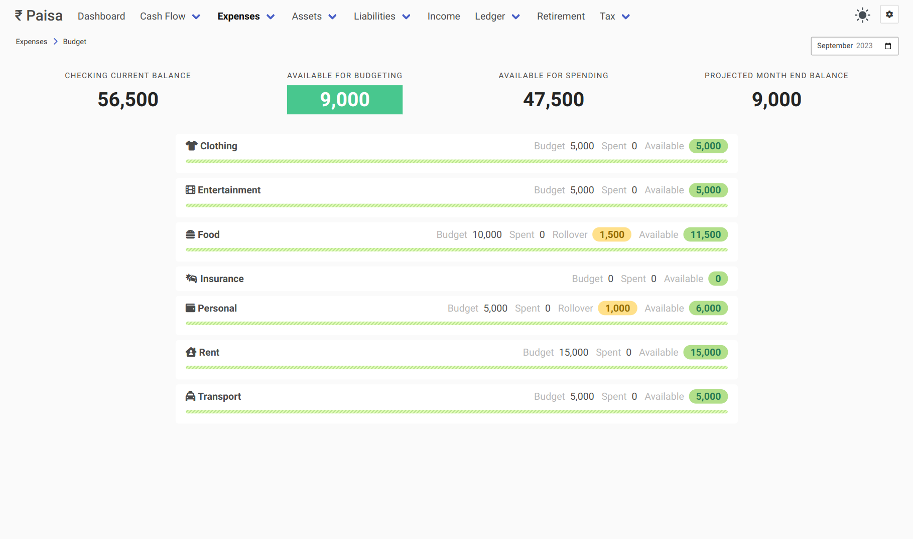

# Budget

Paisa supports a simple budgeting system. Let's say you get 50000 INR
at the beginning of the month. You want to budget this amount and
figure out how much you can spend on each category.

Let's add a salary transaction to the ledger:

```ledger
2023/08/01 Salary
    Income:Salary:Acme         -50,000 INR
    Assets:Checking
```

Now you have 50k in your checking account. Let's budget this amount:

```ledger
~ Monthly in 2023/08/01
    Expenses:Rent               15,000 INR
    Expenses:Food               10,000 INR
    Expenses:Clothing            5,000 INR
    Expenses:Entertainment       5,000 INR
    Expenses:Transport           5,000 INR
    Expenses:Personal            5,000 INR
    Assets:Checking
```

The `~` character indicates that this is a periodic transaction. This
is not a real transaction, but used only for forecasting purposes. You
can read more about [periodic expressions](https://ledger-cli.org/doc/ledger3.html#Period-Expressions) and [periodic transactions](https://ledger-cli.org/doc/ledger3.html#Budgeting-and-Forecasting).

!!! bug

    Even though the interval part is optional as per the doc, there is a
    [bug](https://github.com/ledger/ledger/issues/1625) in the ledger-cli, so you can't use `~ in 2023/08/01`,
    instead you always have to specify some interval like `~ Monthly in 2023/08/01`.

[Initial Budget](../images/budget-1.png)

Now you can see that you will have 5k left in your checking account at
the end of the month, if you spend as per your budget. Before you
spend, you can check your budget and verify if you have money
available under that category.

Let's add some real transactions.

```ledger
2023/08/02 Rent
    Expenses:Rent               15,000 INR
    Assets:Checking

2023/08/03 Transport
    Expenses:Transport           1,000 INR
    Assets:Checking

2023/08/03 Food
    Expenses:Food                8,500 INR
    Assets:Checking

2023/08/05 Transport
    Expenses:Transport           2,000 INR
    Assets:Checking

2023/08/07 Transport
    Expenses:Transport           3,000 INR
    Assets:Checking

2023/08/10 Personal
    Expenses:Personal            4,000 INR
    Assets:Checking

2023/08/15 Insurance
    Expenses:Insurance           10000 INR
    Assets:Checking
```



As the month progresses, you can see how much you have spent and how
much you have left. You notice that you have overspent on transport
and you have missed the insurance payment. You have a budget deficit
now. That means, you can't actually spend as per your budget. You have
to first bring the deficit back to 0. Let's cut down the entertainment
and clothing budget to 0

```ledger hl_lines="4-5"
~ Monthly in 2023/08/01
    Expenses:Rent              15,000 INR
    Expenses:Food              10,000 INR
    Expenses:Clothing               0 INR
    Expenses:Entertainment          0 INR
    Expenses:Transport          5,000 INR
    Expenses:Personal           5,000 INR
    Assets:Checking
```



You can go back and adjust your budget anytime. Let's move on to the
next month, assuming you haven't made any further transaction.

```ledger
2023/09/01 Salary
    Income:Salary:Acme        -50,000 INR
    Assets:Checking

~ Monthly in 2023/09/01
    Expenses:Rent              15,000 INR
    Expenses:Food              10,000 INR
    Expenses:Clothing           5,000 INR
    Expenses:Entertainment      5,000 INR
    Expenses:Transport          5,000 INR
    Expenses:Personal           5,000 INR
    Assets:Checking
```



You can see a new element in the UI called Rollover[^1]. This is basically
the amount you have budgeted last month, but haven't spent. This will
automatically rollover to the next month. That's pretty much it.

To recap, there are just two things you need to do.

1) Create a periodic transaction at the beginning of the month when
you get your salary.

2) Adjust your budget as you spend and make sure there is no deficit.

[^1]: If you prefer to not have rollover feature, it can be disabled in the [configuration](../reference/config.md) page.
